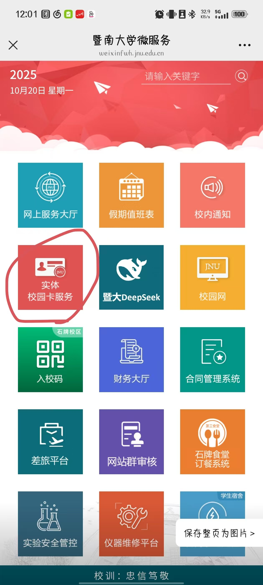
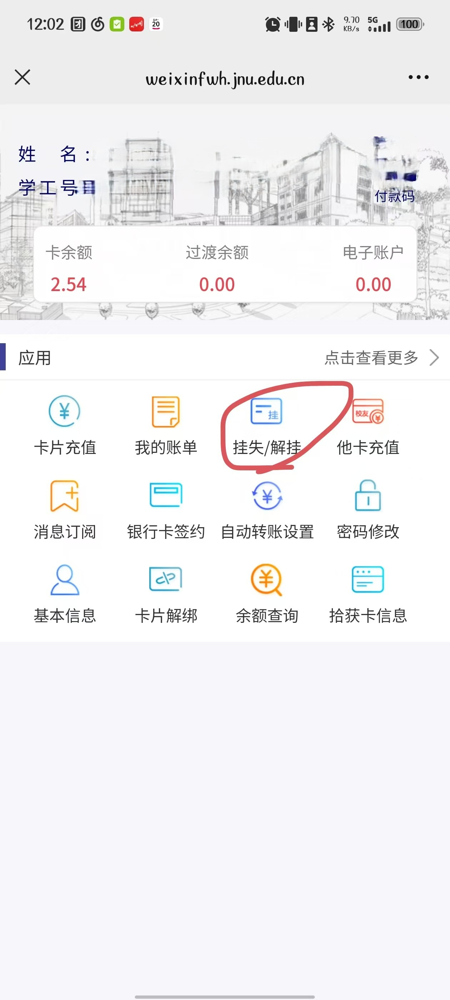

# 暨南大学校园卡申请（补换）
## 校园卡丢失怎么办
如果你的校园卡真的不见了，先不要急

## 1. 打开手机，搜索`暨南大学微服务`

## 2. 选择`实体校园卡服务`

## 3. 选择`挂失/解挂`

## 4. 到珠海校区网络与教育技术中心（`实验楼C412`）前台根据指引进行补办
!> 1. 携带**个人有效证件**前往校园卡服务点办理
2. 申请人核对以及**填写补卡申请表**并**缴费**
3. 工作人员审核资料并制作卡片
4. 申请人**领卡**

!> 	1. 在校教职工和学生可申请补换卡，已离校人员不予补换卡；其他人员需提供在校证明方可补换卡。
2. 请仔细核对及填写申请表个人信息。
3. 须遵守学校规章制度和校园一卡通有关管理规定。
4. 由于填写数据出错造成校园卡作废等一切后果由本人负责。

?> 学生补办校园卡需要**15元工本费**
可以在**第二个工作日的上班时间**（上午8：00-12:00，下午14：30-17：30）来前台拿你的校园卡

> sdkfjkj