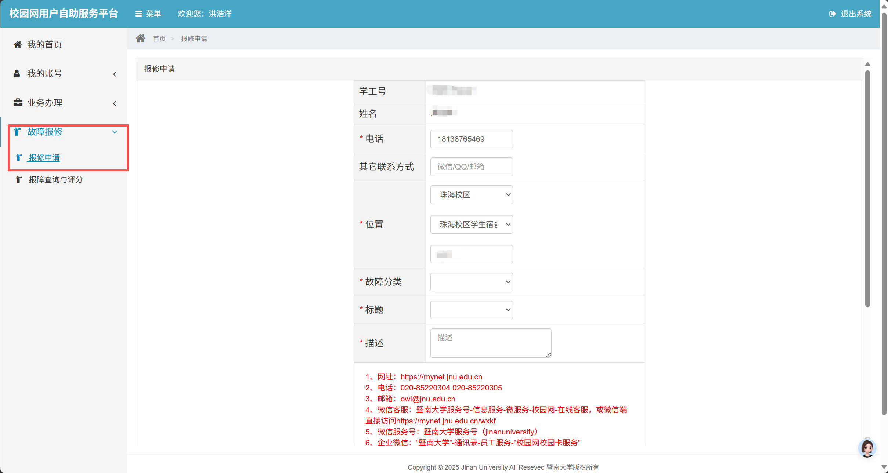

# 校园网维修支持
校园网有专门的勤工助学部门——网络服务小组进行维护和检修，当用户的校园网出现问题，没有办法正常使用时，可以使用线上报单平台进行报修，以下是操作步骤

## 1. 进入Mynet

使用手机扫描下面的二维码：

或者直接输入Mynet平台网址：[Mynet](https://mynet.jnu.edu.cn)

## 2. 打开菜单
在左侧菜单栏中打开故障报修$\rightarrow$报修申请

## 3. 根据指引填写故障情况即可
故障情况填写小贴士：在故障描述中尽量描述清楚以下几点，可以让维修人员更好的知晓你的故障情况哦：

- 具体是什么设备故障？是卡顿还是直接断网？
- 什么时候开始有这个问题的？
- 自己尝试过什么解决方法？
- 以前有没有出现过类似的问题？
> 当然如果有日志的话维修班的同学会感激涕零的(×)