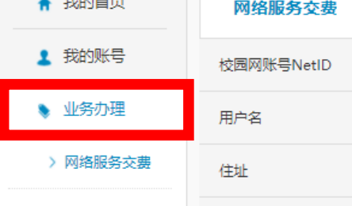
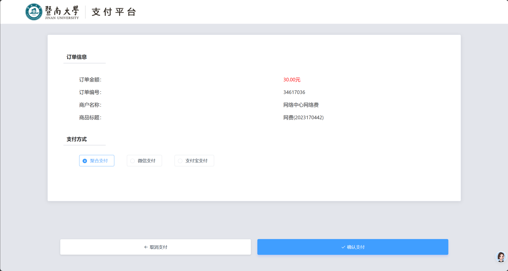

# 要用网，先办网——Mynet平台操作指南

## 1. 进入Mynet

使用手机扫描下面的二维码：

或者直接输入Mynet平台网址：[Mynet](https://mynet.jnu.edu.cn)

## 2. 修改密码
平台的账号是**学号**，初始密码是**身份证or通行证(外招)后六位**，初次登录校园网处于安全考虑，建议修改密码

## 3. 选择办理业务
无论是初次办理校园网还是转为校园网、续费校园网，登录mynet平台后选择右侧**业务办理**,再选择网络服务交费 

 根据需求选择服务类型（单出口、多出口、“多出口网络”→“将剩余有效期升级为多出口”）及服务时长，接受用户协议并提交订单，根据提示缴费

> 注意：办理电信网不经过Mynet平台，需要找电信经理，以上仅涉及校园网办理步骤。