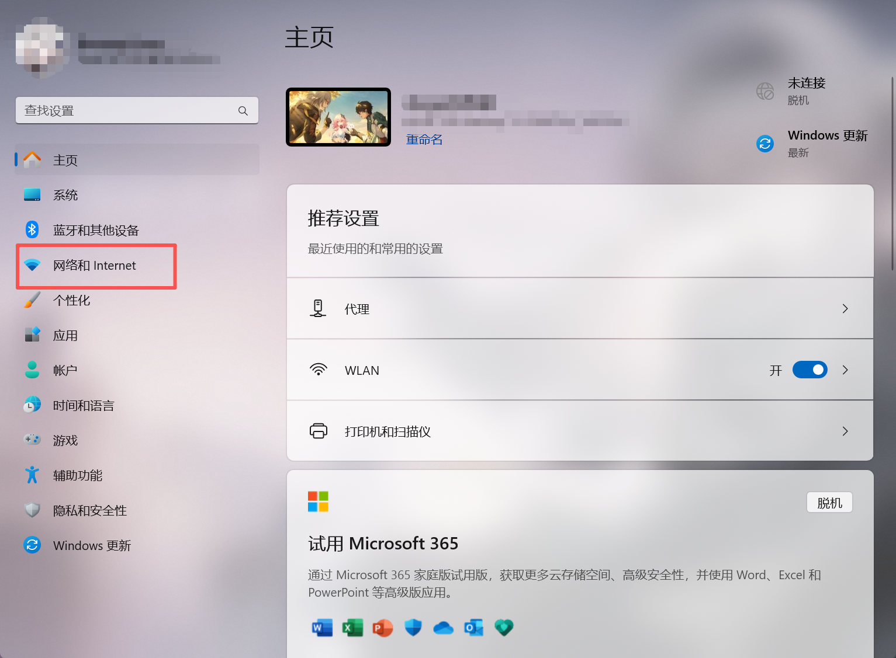
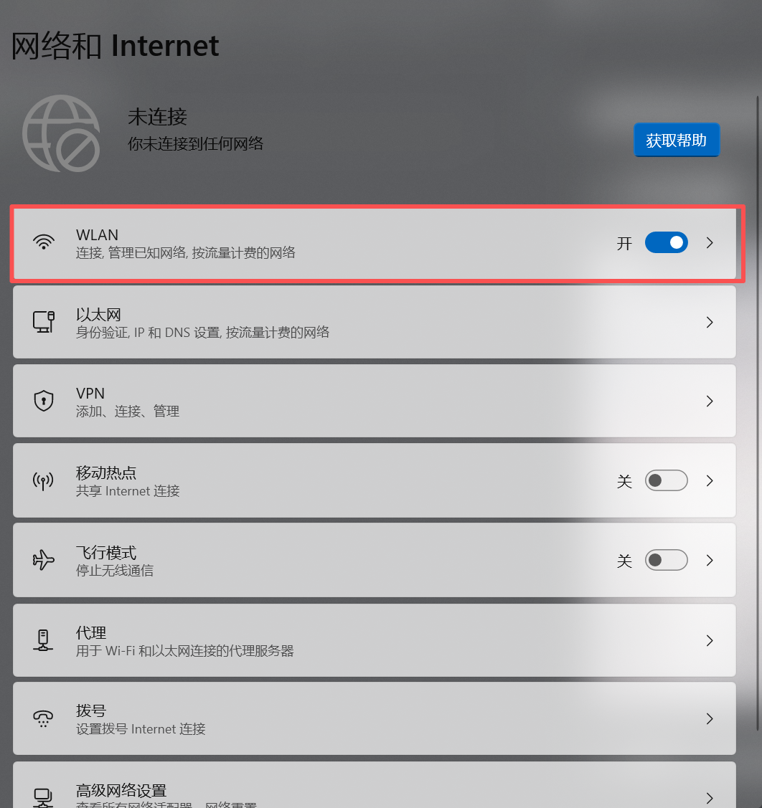
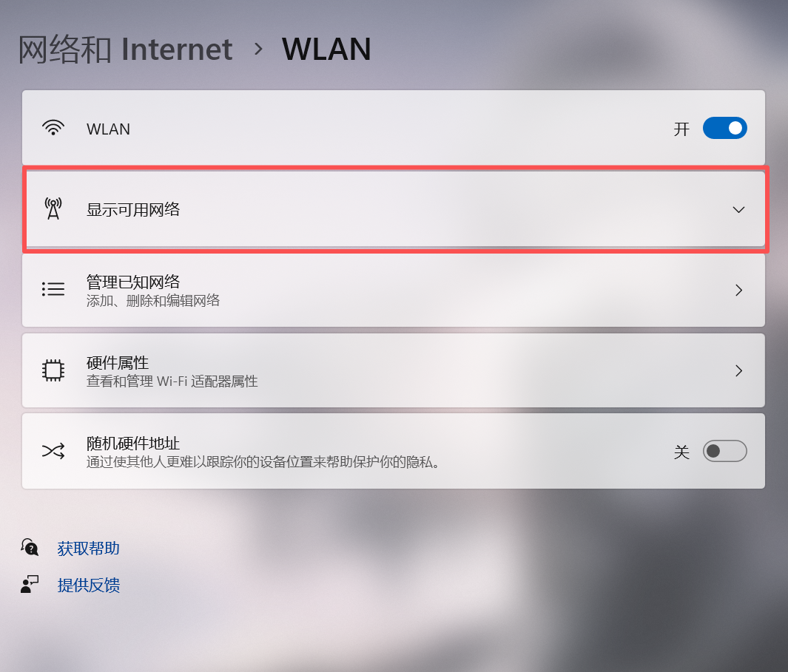
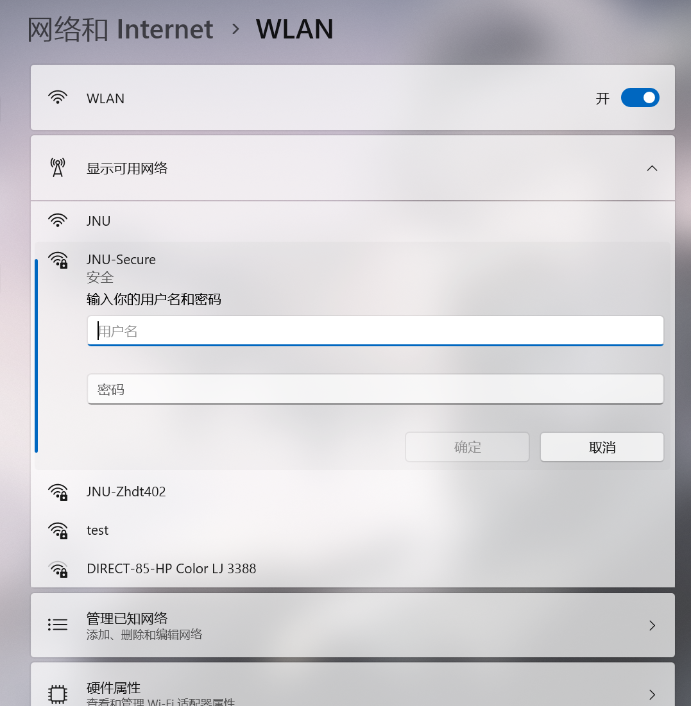

# windows系统连接Jnu-Secure
## 1. 打开`设置`

## 2. 点开`Wlan`

## 3. 显示`可用网络`

## 4. 点击`Jnu-Secure`并点击`连接`按钮

## 5. 输入学号和账号密码连接即可
> 默认密码是你的身份证or通行证后6位，如果更改密码之后忘记密码可以查看此链接：
[校园网密码重置](../../校园网/校园网其他问题/校园网密码重置.md)
