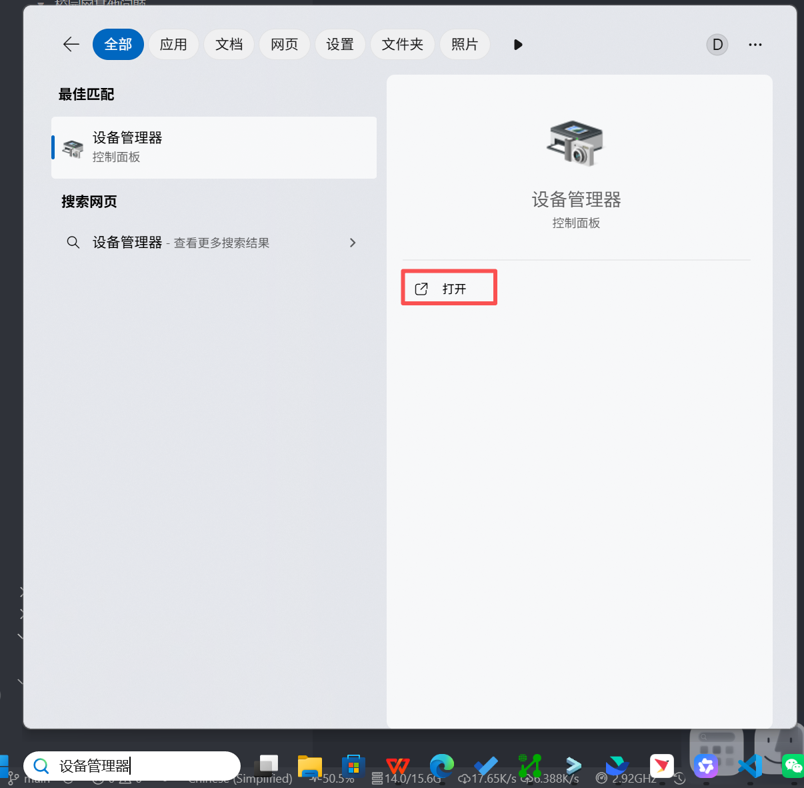
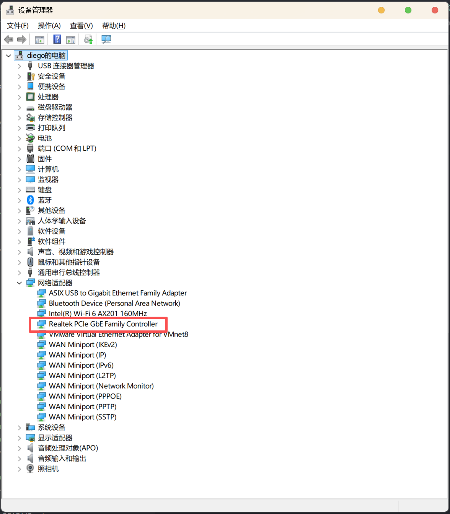
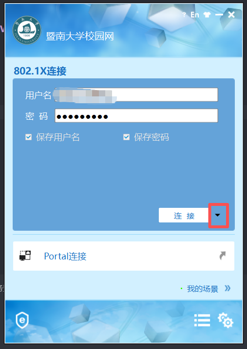
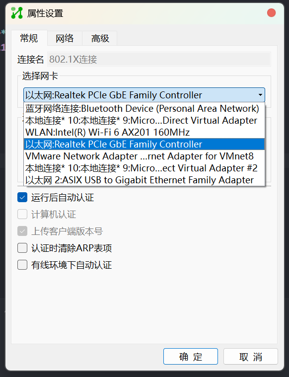

# windows有线网连接
!> 请在安装前退出“360安全卫士”及“360杀毒”，以保证正常安装
请检查[有线网准备工作情况](校园网/校园网连接/有线网准备工作.md)是否完备
完成安装后，请重启电脑

## 1. 打开设备管理器

## 2. 选择网络适配器，查看网卡
记住你的网卡是啥~
查找拥有以下字段的项：
- Ethernet(以太网)
- GbE(千兆以太网)

大多都是以下两种网卡适配器：
1. **Realtek PCle GbE Family Controller**
2. **Intel(R) Ethernet Connection (3)1218-V**

## 3. 打开inode软件
1. 点击右下角按钮旁边的小三角，点击`属性`

2. 进入属性面板打开`选择网卡`下拉菜单栏，选择[第二步](#_2-选择网络适配器查看网卡)确定的网卡(以以太网字样作为开头)

3. 点击`确定`，输入学号和密码，点击`连接`

?> 默认密码是你的身份证or通行证后6位，如果更改密码之后忘记密码可以查看此链接：
[校园网密码重置](../../校园网/校园网其他问题/校园网密码重置.md)

!> [维修支持](../../校园网/Mynet平台/维修支持.md)