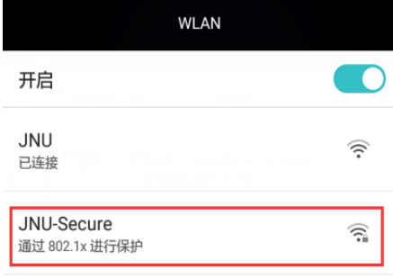

# 安卓手机连接Jnu-Secure
## 1. 点开设置$\rightarrow$Jnu-Secure
在“身份”和“密码”输入框分别输入校园网账号和密码，其他保持默认，点击 “连接”。如果不能正常连接，请设置：
| 配置项 | 值 |
| :--- | :--- |
| EAP 方法 | PEAP |
| 阶段 2 身份验证 | 无/None |
| CA 证书 | 不验证 |
| 身份 | 学号 |
| 匿名身份 | （不填，留空） |
| 密码 | Mynet 平台密码 |
> 默认密码是你的身份证or通行证后6位，如果更改密码之后忘记密码可以查看此链接：
[校园网密码重置](../校园网其他问题/校园网密码重置.md)

## 2. 看到连接成功字样就可以爽玩了