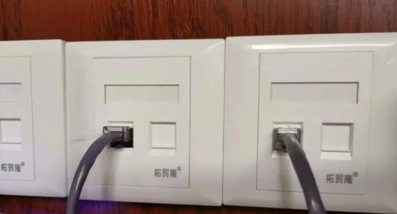
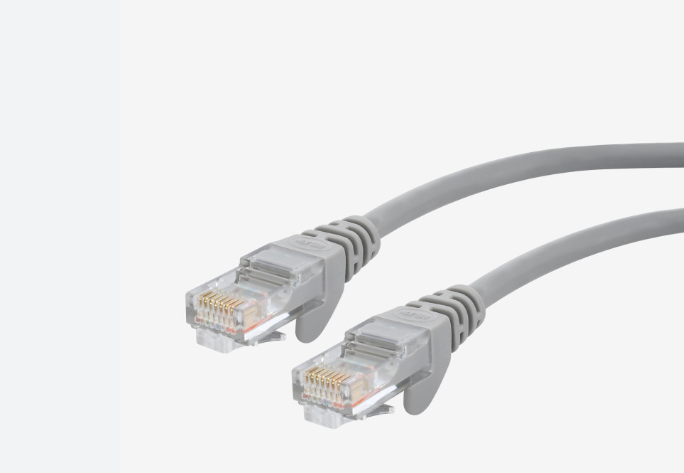
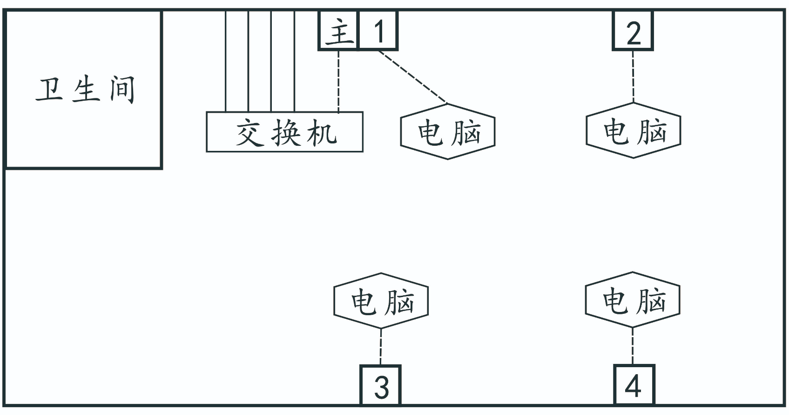
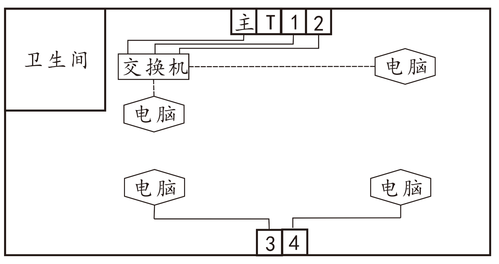
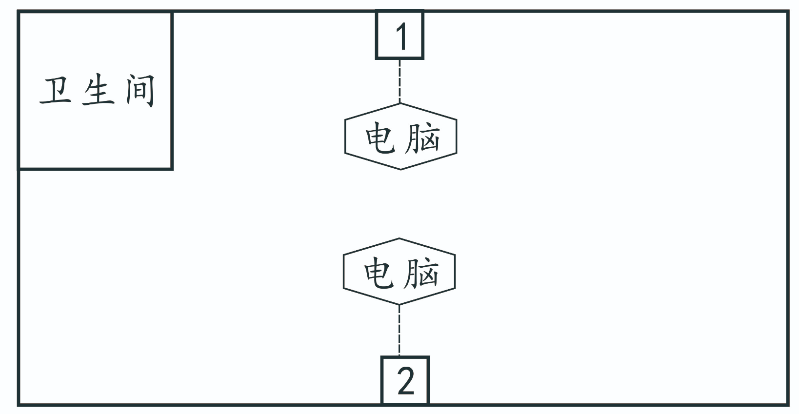

# 有线网准备工作
!> 请检查你的设备是否有网口以及有线网适配器

在连接校园网之前，你需要在物理层面上将校园网的物理链路打通，学校网络中心已经帮你把99%的事情干好了，剩下的1%可以跟着本教程一步步来~

## 准备工作
1. 网线
    - 根据你的网络情况准备网线（5,6类网线即可，视宿舍情况评估长度，大约2-5米即可）
        - 1-4栋：一人使用一条，两人使用三条，三人使用四条，四人使用五条
        - 5-7栋：一人使用一条，两人使用（都位于主端口一侧）三条，两人使用（一个位于主端口一侧，一个远离主端口一侧）四条，三人使用（一人远离主端口）5条，三人使用（两人远离主端口）6条，四人使用7条
        - 8-9栋：两条

2. 交换机
    - 如果是大于一个人使用有线网，那么只需要网线，如果是多个人需要使用有线网，就需要买**五口交换机**。
    交换机样式如下：
    

3. 确保你有一个良好的网络环境，比如让主机连接有线网，或者有可以下载软件的设备

4. 下载对应设备的iNode软件，下载链接如下：[inode软件下载](https://netc.jnu.edu.cn/rjxz/list.htm)
注意下载珠海的IMC，不要下载到别的校区的

!> 目前inode软件并没有MacOS版本，敬请期待

5. 其他：
- 网口样式如下（主端口同）：

- 网线样式如下：

## 物理链路连接

1. 仔细观察自己所在楼栋的拓扑，**找到主端口位置**（一般靠近厕所）

### 1-4栋楼栋拓扑
连接方法：
- 使用一条网线将**主端口**和**五口交换机的主端口**连接
- 将**主端口旁边暴露出的三条网线**分别插在交换机的其余三个端口
- 看交换机**提示灯亮**表示连线成功
- 在各自**座位附近**查找网口，插上即可

### 5-7栋楼栋拓扑
连接方法：
- 使用一条网线将**主端口**和**五口交换机的主端口**连接
- 将**主端口旁边的两个端口**用**两条网线**连接从1,2分发到对面的3,4
- **主端口一侧**的用户可以**直连交换机的两个口**使用
- **远离主端口一侧**的用户可以从**各自座位附近的网口**连接网线使用

### 8-9栋楼栋拓扑
连接方法：直连即可 

!> 注意，8-9栋有线网用户上限为2

