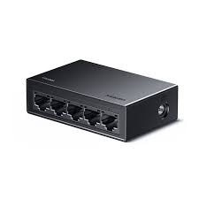

# 有线网准备工作
!> 请检查你的设备是否有网口以及有线网适配器

在连接校园网之前，你需要在物理层面上将校园网的物理链路打通，学校网络中心已经帮你把99%的事情干好了，剩下的1%可以跟着本教程一步步来~

## 准备工作
1. 网线
    - 根据你的网络情况准备网线（一个人买一条，两个人买三条，三个人四条，四个人买五条，大约2m就可以啦）

2. 交换机
    - 如果是大于一个人使用有线网，那么只需要网线，如果是多个人需要使用有线网，就需要买**五口交换机**。
    交换机样式如下：
    

3. 确保你有一个良好的网络环境，比如让主机连接有线网，或者有可以下载软件的设备

4. 下载对应设备的iNode软件，下载链接如下：[inode软件下载](https://netc.jnu.edu.cn/rjxz/list.htm)

## 物理链路连接

1. 仔细观察自己所在楼栋的拓扑，找到主端口位置（一般靠近厕所）
