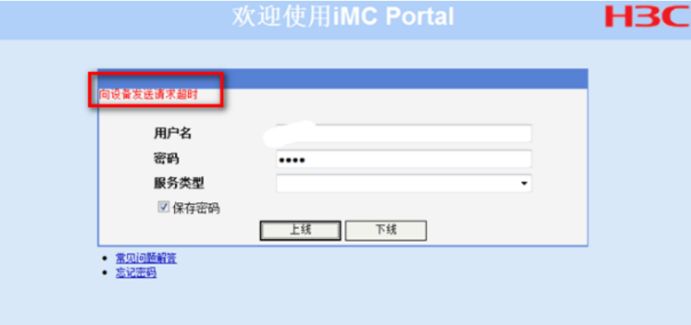

# IMC用户自动服务平台
目前校区的无线网采用两种认证方式：Portal和802.1x认证（也就是常说的JNU-Secure），Protal认证是机房上网最常见的一种认证方式，因为其简单、方便，不需要任何客户端的优点而被广泛用于临时连接网络使用。需要注意的一点是，**JNU和JNU-Secure的使用设备数量计算方式统一**，举个例子，当你买了单终端校园网，JNU和JNU-Secure连接设备的数量加起来不能超过一个。否则会出现卡顿、强制下线等问题。

界面如下：

| 错误代码 | 错误原因 | 解决办法 |
|---------|---------|---------|
| E63013 | 加入黑名单 密码连续输入错误50次 | 到C412清理黑名单 |
| E63015 | 用户已失效 | 账号到期，续费就好 |
| E63018 | 用户不存在 | 账号输入错误、用户没有申请校园网服务或账号同步问题 |
| E63022 | 在线用户数量限制 | 让冲突设备下线或后台清理在线终端且等待认证服务器连接失效后可解决 |
| E63032 | 密码错误 | 如果没有办法解决，建议同学自助改密或重置密码 |
| E63073 | 用户场景限制 | 服务类型错误，电信网用户不可以使用JNU和JNU-Secure |
| E63632 | 绑定终端数量达到限制 | 后台清理多余终端 |