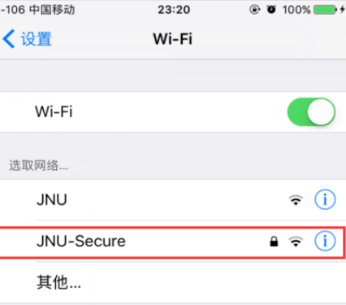
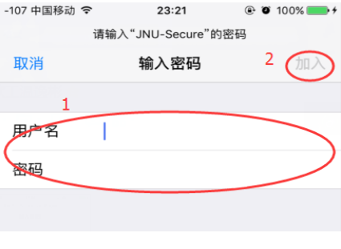
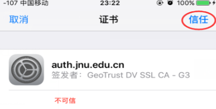

# 苹果手机连接Jnu-Secure
## 1. 打开手机→设置→设置WIFI

## 2. 在“用户名”和“密码”输入框分别输入校园网账号和密码，点击右上角“加入”

?> 默认密码是你的身份证or通行证后6位，如果更改密码之后忘记密码可以查看此链接：
[校园网密码重置](../校园网其他问题/校园网密码重置.md)

## 3. 首次连接会弹出证书验证提示，点击“接受”

## 4. 看到连接成功字样即可